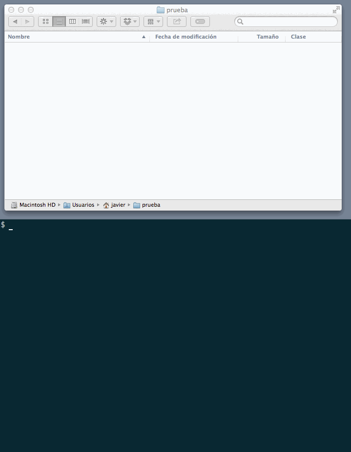

THIS IS A PROOF OF CONCEPT
==========================

Symfony Toolbelt is a project that aims to develop a set of utilities for Symfony project management. **The only utility developed so far is a new Symfony installer**.

Symfony installer
-----------------

Currently, to start a new Symfony project in the `blog/` directory you must execute the following command:

```bash
$ composer create-project symfony/framework-standard-edition blog/
```

Then you have to wait up to several minutes (depending on your Composer cache, CPU power and network connection) and you'll see tens of lines of debug messages.

The **new Symfony installer** aims to drastically simplify this process. To start a new Symfony project in the `blog/` directory you must execute the following command:

```bash
$ symfony new blog/
```

The you have to wait a few seconds (usually less than 10) and you'll see a beautiful and helpful message as result. Here it is a recording of the actual working of this new installer.



By default, the new project is created using the latest Symfony version. If you want to install a specific version, provide it as the second optional argument:

```bash
$ symfony new blog/ 2.2.5
```

If this Symfony Toolbelt is accepted officially, its use would be as simple as follows (this doesn't work right now):

```
# install the toolbelt (do this only once)
$ composer global require "symfony/toolbelt=~1.0"

# use the toolbelt (global command available everywhere)
$ symfony

# update the toolbelt
$ symfony self-update
```
